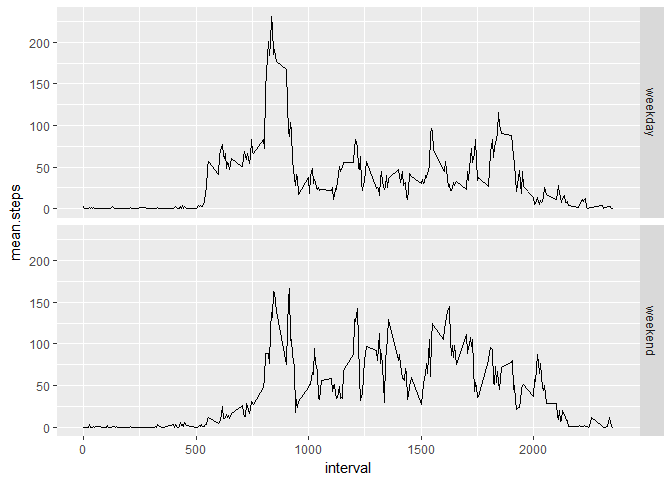

## Loading and preprocessing the data


```r
# library(dplyr)
activity_data <- read.csv(unz("activity.zip","activity.csv"), na.strings = "NA")
#activity_data$date <- as.Date(activity_data$date, "%Y-%m-%d")
# activity_data <- group_by(activity_data, date)
```

## What is mean total number of steps taken per day?


```r
library(plyr)
summaryByDay <- plyr::ddply(activity_data, .(date), summarize, total.steps = sum(steps, na.rm = TRUE), mean.steps = mean(steps, na.rm = TRUE), median.steps = median(steps[steps>0], na.rm = TRUE))
head(summaryByDay)
```

```
##         date total.steps mean.steps median.steps
## 1 2012-10-01           0        NaN           NA
## 2 2012-10-02         126    0.43750         63.0
## 3 2012-10-03       11352   39.41667         61.0
## 4 2012-10-04       12116   42.06944         56.5
## 5 2012-10-05       13294   46.15972         66.0
## 6 2012-10-06       15420   53.54167         67.0
```

Now to plot histogram of total steps taken per day.


```r
library(ggplot2)
qplot(total.steps, data = summaryByDay, bins = 20)
```

<!-- -->

## What is the average daily activity pattern?

First, create a table containing the averages of the 5-minute intervals.


```r
fiveMinSum <- plyr::ddply(activity_data, .(interval), summarize, mean.steps = mean(steps, na.rm = TRUE))
```

Now, create the time-series plot


```r
qplot(interval, mean.steps, data = fiveMinSum, geom = "line")
```

<!-- -->

```r
maxSteps <- max(fiveMinSum$mean.steps)
maxInterval <- fiveMinSum[fiveMinSum$mean.steps == maxSteps,]
```
The 5-min interval with the highest step count is 835, with 206.1698113 steps on average.

## Imputing missing values

First, find the vector that represents the indices of NA values in the activity_data table (original dataset). Then, create second dataset with imputed values, calculated as the **mean of steps taken in that 5 minute interval** (as seen in fiveMinSum)


```r
activityNA <- is.na(activity_data$steps)
#Then, replace data with calculated means ini fiveMinSum$mean.steps for that 5 min interval
activity_data2 <- activity_data
activity_data2$steps[activityNA] <- fiveMinSum$mean.steps[match(activity_data2$interval, fiveMinSum$interval)][activityNA]
```

## Are there differences in activity patterns between weekdays and weekends?

Adjust the date column to be a date (currently as factor)


```r
activity_data2$date <- as.Date(activity_data2$date, "%Y-%m-%d")
library(lubridate)
activity_data2$week <- factor(ifelse(wday(activity_data2$date, label = TRUE) %in% c("Sat","Sun"),"weekend","weekday"))

#Create summary by weekday/weekend, and plot it
weekSummary <- plyr::ddply(activity_data2, .(week, interval), summarize, mean.steps = mean(steps, na.rm = TRUE))
qplot(interval, mean.steps, data = weekSummary, geom = "line", facets = week~.)
```

<!-- -->
